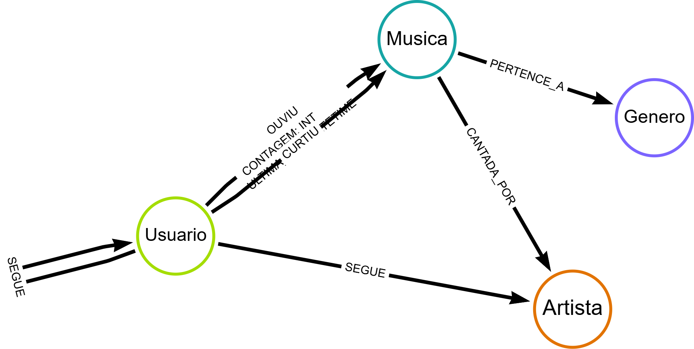

# 🎵 Algoritmo de Recomendação de Músicas com Neo4j

Este repositório contém a solução para o desafio de projeto **"Criando um Algoritmo de Recomendação de Músicas Com Base Em Grafos"**. O objetivo foi modelar e popular um banco de dados orientado a grafos (Neo4j) para simular um sistema de streaming e criar recomendações personalizadas.

## 📋 Sobre o Projeto

A proposta deste projeto é utilizar a força dos relacionamentos em grafos para sugerir músicas a usuários. Diferente de bancos relacionais, o Neo4j permite navegar conexões complexas (como "amigos que curtiram o mesmo artista") de forma performática.

A solução abrange:
1.  **Modelagem do Domínio:** Criação das entidades (Nós) e conexões (Relacionamentos) que representam o ecossistema musical.
2.  **Carga de Dados:** Script Cypher para popular o banco com dados fictícios.
3.  **Visualização:** Uso do Neo4j Bloom/Browser para inspecionar os clusters de dados.

## 🖼️ Modelagem dos Dados

Abaixo, o diagrama esquemático da solução proposta:




### Nós (Nodes)
* **Usuario:** O ouvinte da plataforma.
* **Musica:** A faixa de áudio.
* **Artista:** Quem interpreta a música.
* **Genero:** A categoria musical (ex: Pop, Rock).

### Relacionamentos (Relationships)
* `(:Usuario)-[:OUVIU {contagem, ultima_vez}]->(:Musica)`: Histórico de reprodução com propriedades de frequência.
* `(:Usuario)-[:CURTIU]->(:Musica)`: Preferência explícita.
* `(:Usuario)-[:SEGUE]->(:Artista)`: Fã do artista.
* `(:Usuario)-[:AMIGO_DE]->(:Usuario)`: Rede social interna para recomendações colaborativas.
* `(:Musica)-[:CANTADA_POR]->(:Artista)`: Autoria.
* `(:Musica)-[:PERTENCE_A]->(:Genero)`: Classificação.

## 🕸️ Grafo Resultante

Exemplo visual do banco de dados populado, mostrando a interconexão entre usuários, suas músicas favoritas e círculos de amizade:


## 🛠️ Tecnologias Utilizadas

* **Neo4j:** Banco de dados orientado a grafos.
* **Cypher Query Language:** Linguagem de consulta para criação e manipulação dos dados.
* **Neo4j Browser / Bloom:** Ferramentas de visualização.

## 🚀 Como Executar

### Pré-requisitos
* Instância do Neo4j (Pode ser via Docker, Neo4j Desktop ou AuraDB).

### Passo a Passo
1.  Acesse o console do seu banco Neo4j.
2.  Copie o código contido no arquivo `script.cypher` (ou o nome do seu arquivo).
3.  Cole no terminal do Neo4j e execute para criar os nós e relacionamentos.

### Aqui a Consulta de Recomendação feita para o Projeto

```cypher
// 1. Criando Gêneros (Os grandes grupos)
CREATE (gRock:Genero {nome: "Rock", cor: "#FF0000"})
CREATE (gPop:Genero {nome: "Pop", cor: "#00FF00"})
CREATE (gJazz:Genero {nome: "Jazz", cor: "#0000FF"})
CREATE (gEletronica:Genero {nome: "Eletrônica", cor: "#FFFF00"})

// 2. Criando Artistas
CREATE (aQueen:Artista {nome: "Queen"})
CREATE (aFloyd:Artista {nome: "Pink Floyd"})
CREATE (aBeyonce:Artista {nome: "Beyoncé"})
CREATE (aEd:Artista {nome: "Ed Sheeran"})
CREATE (aMiles:Artista {nome: "Miles Davis"})
CREATE (aSinatra:Artista {nome: "Frank Sinatra"})
CREATE (aDaft:Artista {nome: "Daft Punk"})
CREATE (aAvicii:Artista {nome: "Avicii"})

// 3. Criando Músicas e conectando a Artistas e Gêneros
// Rock Cluster
CREATE (mBohemian:Musica {titulo: "Bohemian Rhapsody"})-[:CANTADA_POR]->(aQueen), (mBohemian)-[:PERTENCE_A]->(gRock)
CREATE (mWeWill:Musica {titulo: "We Will Rock You"})-[:CANTADA_POR]->(aQueen), (mWeWill)-[:PERTENCE_A]->(gRock)
CREATE (mWall:Musica {titulo: "Another Brick in the Wall"})-[:CANTADA_POR]->(aFloyd), (mWall)-[:PERTENCE_A]->(gRock)
CREATE (mMoney:Musica {titulo: "Money"})-[:CANTADA_POR]->(aFloyd), (mMoney)-[:PERTENCE_A]->(gRock)

// Pop Cluster
CREATE (mHalo:Musica {titulo: "Halo"})-[:CANTADA_POR]->(aBeyonce), (mHalo)-[:PERTENCE_A]->(gPop)
CREATE (mSingle:Musica {titulo: "Single Ladies"})-[:CANTADA_POR]->(aBeyonce), (mSingle)-[:PERTENCE_A]->(gPop)
CREATE (mShape:Musica {titulo: "Shape of You"})-[:CANTADA_POR]->(aEd), (mShape)-[:PERTENCE_A]->(gPop)
CREATE (mPerfect:Musica {titulo: "Perfect"})-[:CANTADA_POR]->(aEd), (mPerfect)-[:PERTENCE_A]->(gPop)

// Jazz Cluster
CREATE (mBlue:Musica {titulo: "Kind of Blue"})-[:CANTADA_POR]->(aMiles), (mBlue)-[:PERTENCE_A]->(gJazz)
CREATE (mFly:Musica {titulo: "Fly Me To The Moon"})-[:CANTADA_POR]->(aSinatra), (mFly)-[:PERTENCE_A]->(gJazz)
CREATE (mMyWay:Musica {titulo: "My Way"})-[:CANTADA_POR]->(aSinatra), (mMyWay)-[:PERTENCE_A]->(gJazz)

// Electronic Cluster
CREATE (mLucky:Musica {titulo: "Get Lucky"})-[:CANTADA_POR]->(aDaft), (mLucky)-[:PERTENCE_A]->(gPop), (mLucky)-[:PERTENCE_A]->(gEletronica) // Música híbrida!
CREATE (mHarder:Musica {titulo: "Harder, Better, Faster"})-[:CANTADA_POR]->(aDaft), (mHarder)-[:PERTENCE_A]->(gEletronica)
CREATE (mLevels:Musica {titulo: "Levels"})-[:CANTADA_POR]->(aAvicii), (mLevels)-[:PERTENCE_A]->(gEletronica)

// 4. Criando Usuários (Os Nós conectores)
CREATE (uCarlos:Usuario {nome: "Carlos", idade: 25}) // O Rockeiro
CREATE (uAna:Usuario {nome: "Ana", idade: 30}) // A Popzeira
CREATE (uPedro:Usuario {nome: "Pedro", idade: 22}) // O Ecletico
CREATE (uJulia:Usuario {nome: "Julia", idade: 28}) // A Fã de Jazz
CREATE (uMarcos:Usuario {nome: "Marcos", idade: 35}) // O que segue tendências
CREATE (uLuana:Usuario {nome: "Luana", idade: 19}) // Fã de eletrônica

// 5. Criando Interações (O Espaguete Visual)

// Carlos (Rockeiro purista)
CREATE (uCarlos)-[:CURTIU {rating: 5}]->(mBohemian)
CREATE (uCarlos)-[:OUVIU {contagem: 50}]->(mBohemian)
CREATE (uCarlos)-[:OUVIU {contagem: 10}]->(mWall)
CREATE (uCarlos)-[:SEGUE]->(aQueen)
CREATE (uCarlos)-[:SEGUE]->(aFloyd)

// Ana (Pop e um pouco de eletrônica)
CREATE (uAna)-[:CURTIU {rating: 4}]->(mHalo)
CREATE (uAna)-[:OUVIU {contagem: 100}]->(mShape)
CREATE (uAna)-[:OUVIU {contagem: 20}]->(mLucky)
CREATE (uAna)-[:SEGUE]->(aBeyonce)

// Pedro (O Ecletico - Conecta clusters distantes no grafo)
CREATE (uPedro)-[:OUVIU {contagem: 5}]->(mBohemian)
CREATE (uPedro)-[:CURTIU {rating: 5}]->(mShape)
CREATE (uPedro)-[:OUVIU {contagem: 15}]->(mLevels)
CREATE (uPedro)-[:SEGUE]->(aDaft)
CREATE (uPedro)-[:SEGUE]->(aQueen)

// Julia (Jazz e Clássicos)
CREATE (uJulia)-[:CURTIU {rating: 5}]->(mFly)
CREATE (uJulia)-[:OUVIU {contagem: 200}]->(mBlue)
CREATE (uJulia)-[:SEGUE]->(aMiles)
CREATE (uJulia)-[:SEGUE]->(aSinatra)

// Luana e Marcos (Criando volume)
CREATE (uLuana)-[:CURTIU]->(mLevels)
CREATE (uLuana)-[:OUVIU]->(mHarder)
CREATE (uMarcos)-[:OUVIU]->(mMyWay)
CREATE (uMarcos)-[:CURTIU]->(mWeWill)

// 6. Grafo Social (Amizades conectam os gostos)
CREATE (uCarlos)-[:AMIGO_DE]->(uPedro)
CREATE (uPedro)-[:AMIGO_DE]->(uAna) // Pedro conecta o Rockeiro Carlos à Popzeira Ana
CREATE (uAna)-[:AMIGO_DE]->(uLuana)
CREATE (uJulia)-[:AMIGO_DE]->(uMarcos)
CREATE (uMarcos)-[:AMIGO_DE]->(uCarlos) // Fecha um ciclo social
```
